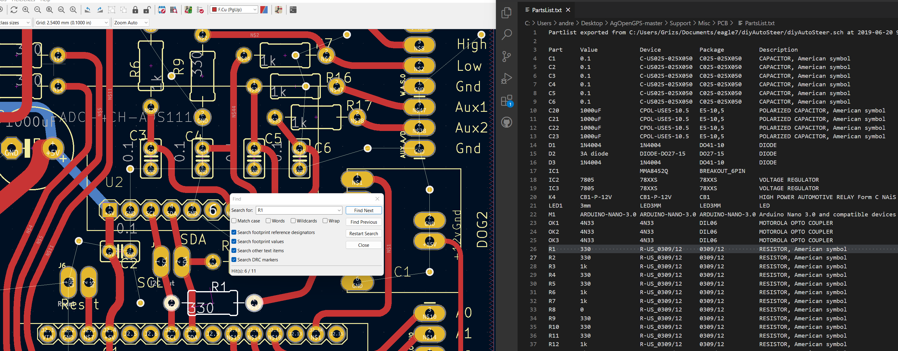

# Building an AOG PCBv2

So, to make life easy, open kicad and the partslist.txt files so you have them handy:

Get your board set up in a jig.

Build your board in the order of lowest -> tallest components. We'll start with the 330k resistors

In Kicad, press CTRL+F and enter "R1". You'll likely start at R10 or something, but just keep searching until you end up in the right place (highlighted in white).

Place your resistor (330k in this instance, see the text file) in R1 and solder in place. In your text file, press TAB at the beginning of the line to indent it, so you know you've done that part.

Work your way through the 330k resistors. When you're done, 9 indents, 9 330k resistors !

Then, start the 1k resistors. Again, as you do each one, indent it in the partslist.

Diodes next, do the two small 1N4004s, and the 3A Diode, then the LED (long leg/anode should be nearest to R19)

Then, fit the opto couplers, only 3 of these.

Then, do the headers - here, I temporarily fitted an arduino ethernet shield, so I could be sure the headers were aligned correctly.

Next, the pins for the on/off.

The ADS1115, solder the pins to it, and the header to the board. Don't fit it into the headers just yet tho.

Then, the green power headers

Voltage regulators next!
