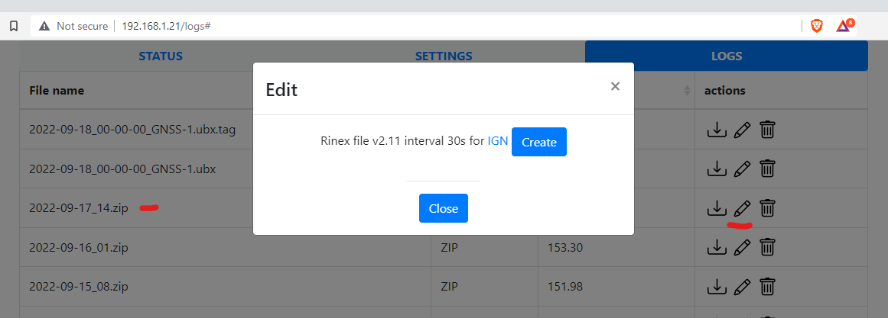
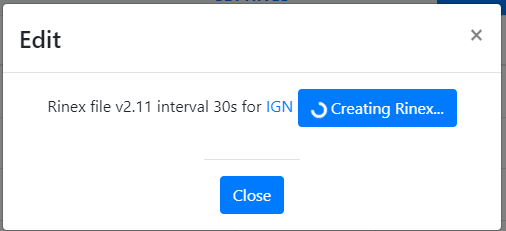
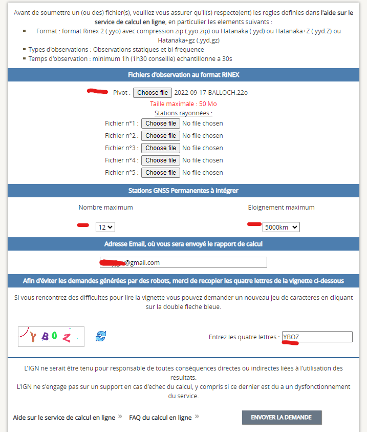
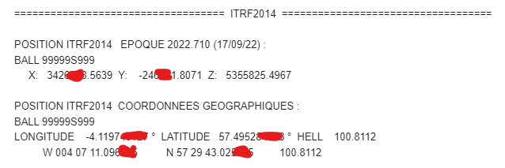

# Configuring your location

It's all plain sailing from here. No more screens full of text, just a couple of buttons and you're done!

So, on the previous page, you saw my RPI had picked an IP address of 192.168.1.20. Without a doubt, yours almost certainly will be different. So ensure you enter YOUR ip address into your browser, and you should see something like this and **this is not the password you set when you configured your Raspberry pi on first boot!!!**.

Here, the default password is "admin", so stick that in.

And hey presto - you're into rtkbase !

Not very useful tho, is it.... but pay attention to that little clipboard icon with the red underline.

In a moment or two - as long as your antenna has a clear view of the sky, you'll see something like this! And note - you want as many of those bars as possible in the green. Lots of red/yellow is not good. Consider your siting position if it's not looking health. Check the [Siting](Siting.md) page for more info.

So, what's happening here? The blue marker is the location, roughly, of your antenna. The crosshair is the hard-location, where rtkbase has been told the base is. Chances are tho, that's not entirely accurate and it needs to be moved to where your base is.

With a clear view of the sky tho, quickly that blue marker will start moving closer to where you really are in the world, but the crosshair is still effectively not-near-you. At this stage, click the little clipboard icon to copy an approximate base location to the clipboard.

Now, go to the Settings tab at the top - this is where all the good stuff happens - and in the "base coordinates" box, paste the numbers you just copied. Then click the blue Save button. No need to change anything else in the "Main Service" section.

Now return to the Status page, and look - things look better already !

Notice tho that the crosshairs are still probably a bit approximate, and the blue marker is wandering about. This is the reading it's getting from the satellites, and the crosshair is where you've told it the base is.

Now, if you're using this RTK for actual surveying, then that's a big deal ! You need to have the crosshairs in exactly the right place as accurate maps kinda rely on that sort of thing. But for differential GPS - RTK - you can be approximate enough and it should still work fine.

What I tend to do however is let that web page with the bars sit for an hour or so, and then copy a new set of co-ordinates over and save them. This gets you to a pretty good baseline.

What you can do however is take a log file and send it off for post-processing, and this should return a very accurate base. Turn on the file service, you might want to change archive duration to 7, and save.

Now, go find something else to do for a day or two. You need at least 24hrs of logging, and once that's done, you'll find them on the Logs tab.

So, here we can see we've had the logs running for a few days. Click the pencil next to one of the ZIP files (not the tag or ubx files)

And click "Create". Also, while that's there, right-click the "IGN" link and do "open in new tab". Or click [this](https://rgp.ign.fr/SERVICES/calcul_online.php) to go straight there.

It'll take a good few minutes to create, and the IGN window... yeah it's all in French, which could be tricky if you don't speak it. But not to worry !

It'll save a file of type .22o. That's fine, so go back to the IGN page and we'll upload it via "Choose file". Only the top one, you don't do the others. Set the other 2 to 12 and 5000km, enter your valid email address and solve the captcha. And that's it. Now you wait for your email to arrive.

Eventually, your email will turn up - about 10 minutes, and it's all very technical looking ! But not to worry, you're pretty much only interested in a couple of bits.

Right at the very bottom, you'll see the estimaged location accuracy - ideally, you want these to be "below 8mm, below 8mm, below 16mm" apparently. These look good enough to me!

Then, scroll up a bit to find the section with POSITION in it. You're interested in the LONGITUDE, LATITUDE and "hell". Err... ok. Notice tho that these are the wrong way round, to what rtkbase expects, but copy them into the "base coordinates" settings page on rtkbase, rearrange so it's LATITUDE LONGITUDE HELL and save. Ignore X and Y etc

And that's it - you should now have a pretty accurate location set!
