# How to assemble the kit

## The hardware, and the software

Don't be daunted - it might seem tricky, but this isn't that bad. And if you get stuck, ping us a message on [Facebook](https://fb.me/freertk).

First, we'll get the rtkbase software installed on the memory card.

The rtkbase home page is [here](https://github.com/Stefal/rtkbase#ready-to-flash-release), and you want to scroll down to "Ready to flash release". Then click the link for the "ready to flash iso file [here](https://github.com/jancelin/pi-gen/releases/latest" and that'll take you to the next page.

At time of writing, that was version [2.3.4](https://github.com/CentipedeRTK/pi-gen_RTKbase/releases/tag/BaseGNSS-RPi-2.3.4), so scroll down until you reach the assets section. You're looking for the biggest file there, highlighted in the below example:

You can unzip the file or not, Etcher will understand it either way.

---

### OK, so we've got the software prepared, now we need to write it to the memory card

Using your card writer/adapter, plug them into your PC
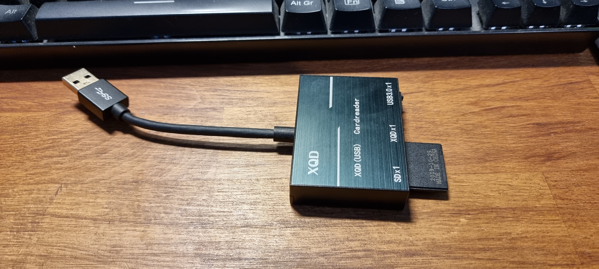

Then, go download [Etcher](https://www.balena.io/etcher/) and run it. You likely want the Installer one.

Now, here's the tricky bit - this piece of software absolutely SHOULD recognise your memory card and NOT your actual hard drives, so you need to pay attention!

If you have a 16gb memory card, then you'll be looking for that sort of size in Etcher. If you've a 32gb card, then you're looking for something in that amount.

I can't stress this enough - **proceed at your own risk here and ensure you are looking at the right device**! Also, if you usually have a USB drive plugged in, of any kind, **UNPLUG IT WHILE YOU DO THIS**!

On my PC, I first did this **without** the memory card installed, and this is what Etcher showed me. It wouldn't let me select a target, and that's correct.

Then, I put my 32gb card in the reader, plugged the reader in and started Etcher again, and this time it found it:

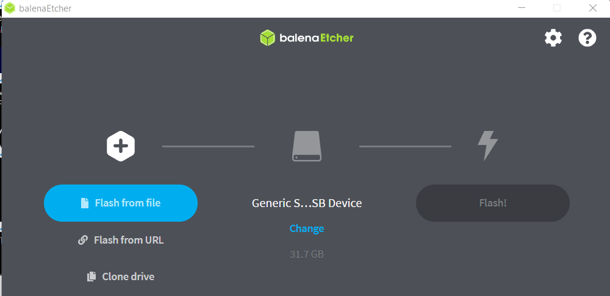

Notice the size is 31.7gb (for my 32gb card, that's right, the numbers won't be exact).

When i selected "Change", I got this additional confirmation:

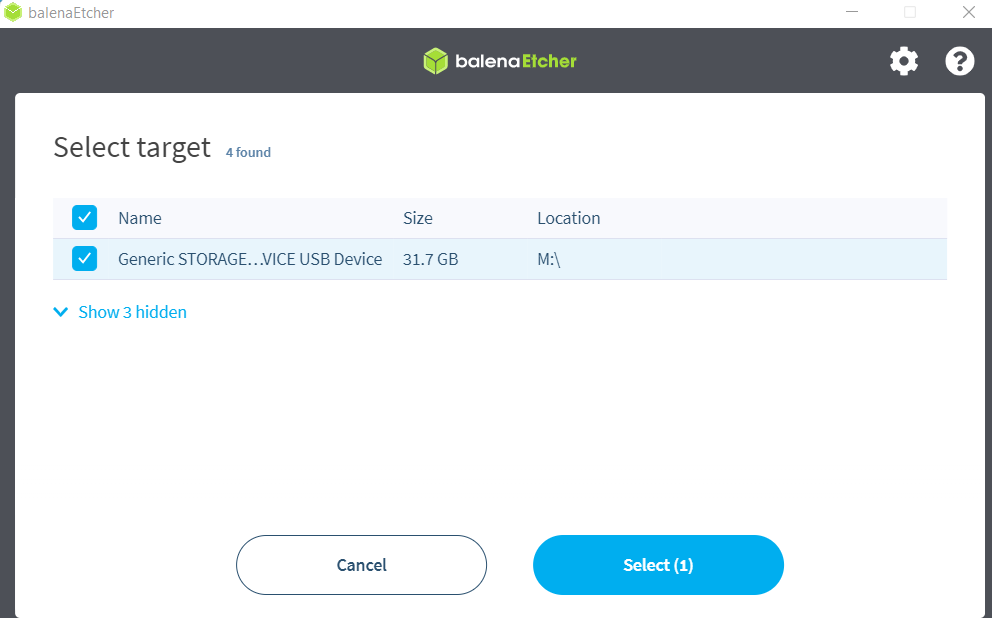

So, now we know we have the right card - and again, if you are in ANY DOUBT DO NOT PROCEED - we can write the image, so you'll be selecting "Flash from file" and pick your downloaded rtkbase file. Note that Etcher understands zip files, so you don't need to expand it first.

So now we have the right device selected, and the image file picked:

Click Flash and accept any prompt that asks if you're sure... the file will then be decompressed, and written to the memory card!

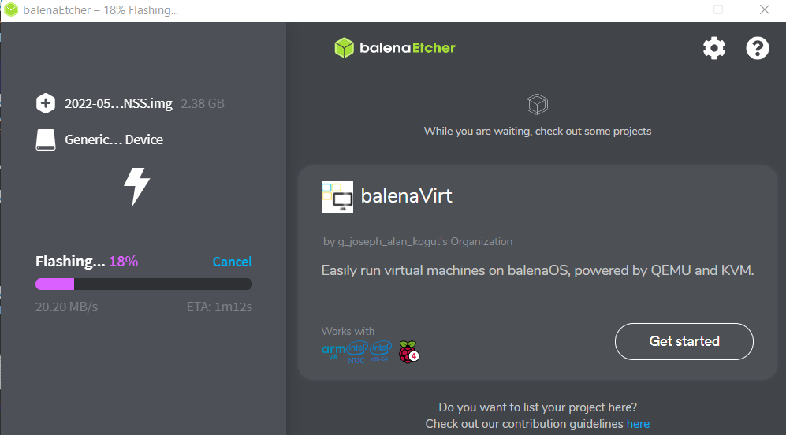

It'll verify it, and then, you're done!

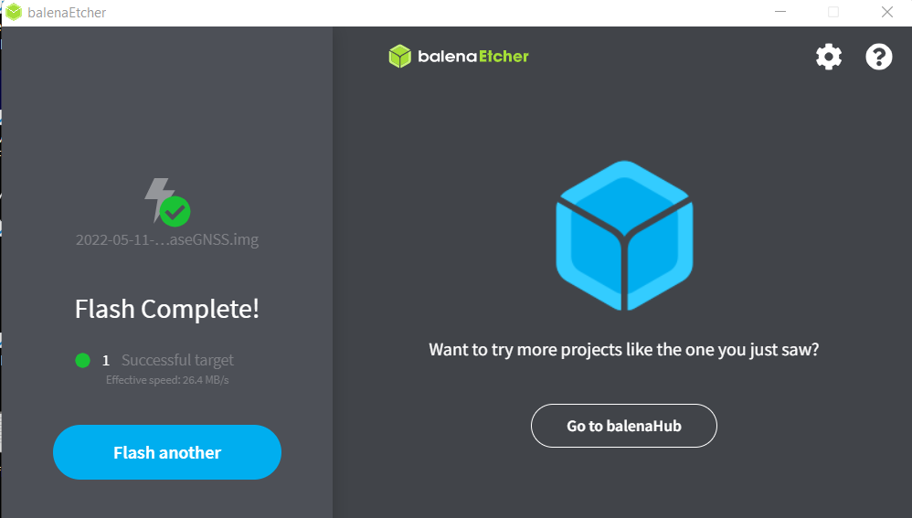

Rather annoyingly, Etcher ejects the drive when finished - so unplug it and plug it straight back in to your computer.

In my case, that pops up as an M: drive, and if I scroll down, right at the bottom I can see an interesting file called wpa_supplicant.conf. If you're going to use wifi, you should edit this now:

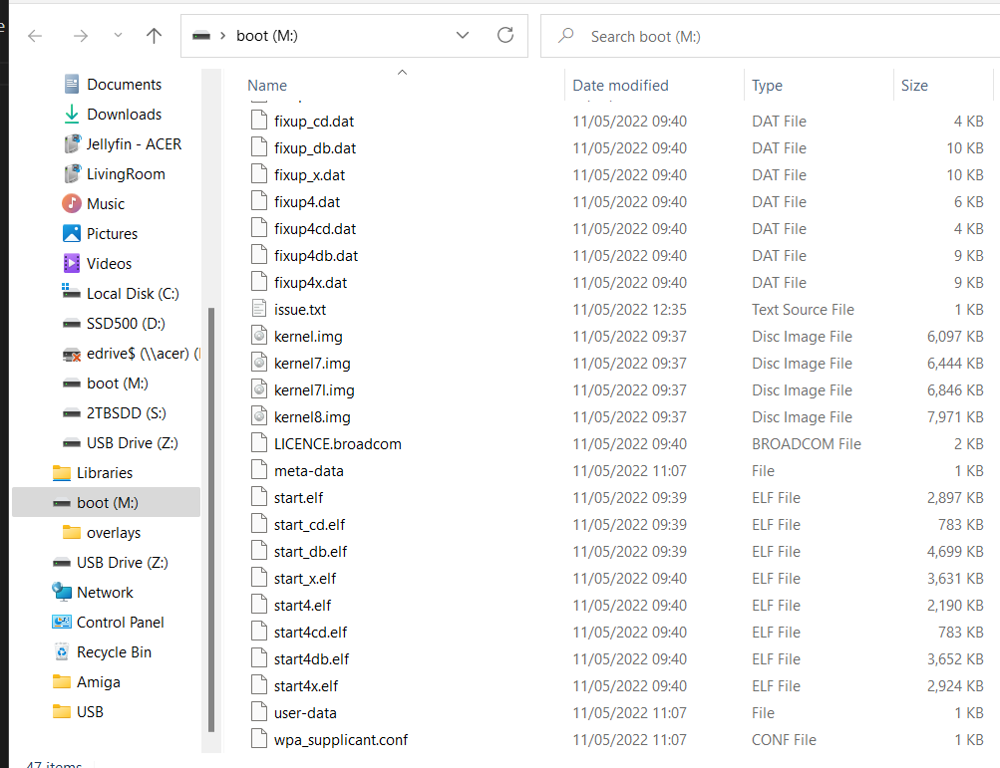

Open it in notepad, and you can see it looks like the following:

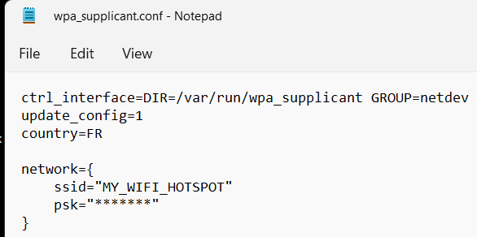

Change it and put your wifi access point name and password in exactly as it should be, with the right upper/lowercase where applicable!!

Save the file, eject the card reader, and you're done!

You're now ready to put the memory card in the raspberry pi, and it'll only go in one way, so don't force it.
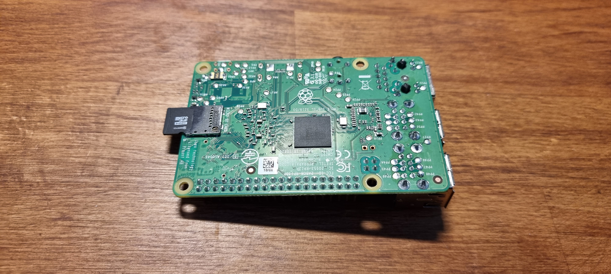

Next, connect the USB keyboard, an HDMI cable, a network cable (if not using wifi), and ensure the TV/monitor is turned on - **and most importantly, plug in the Ublox GPS!!!**. Now, insert the micro USB plug from the power adapter, and it should start booting !

Take note - if your memory card isn't in, then **absolutely nothing** will appear on screen and your monitor/TV will likely go to sleep for "no signal". If that happens, remove power from the Pi, insert memory card again, power back on.

All being well tho, you'll start to see stuff like this!

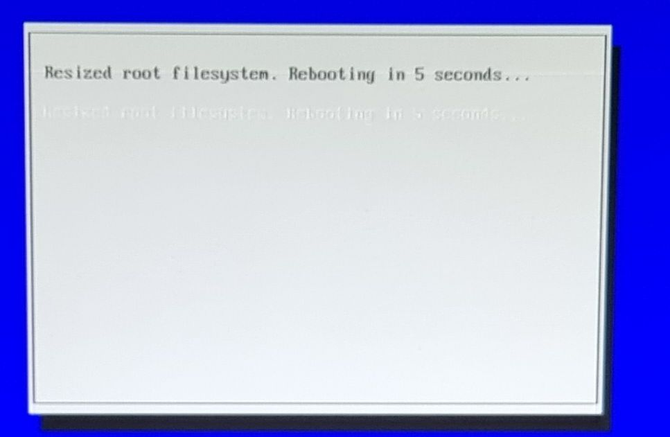
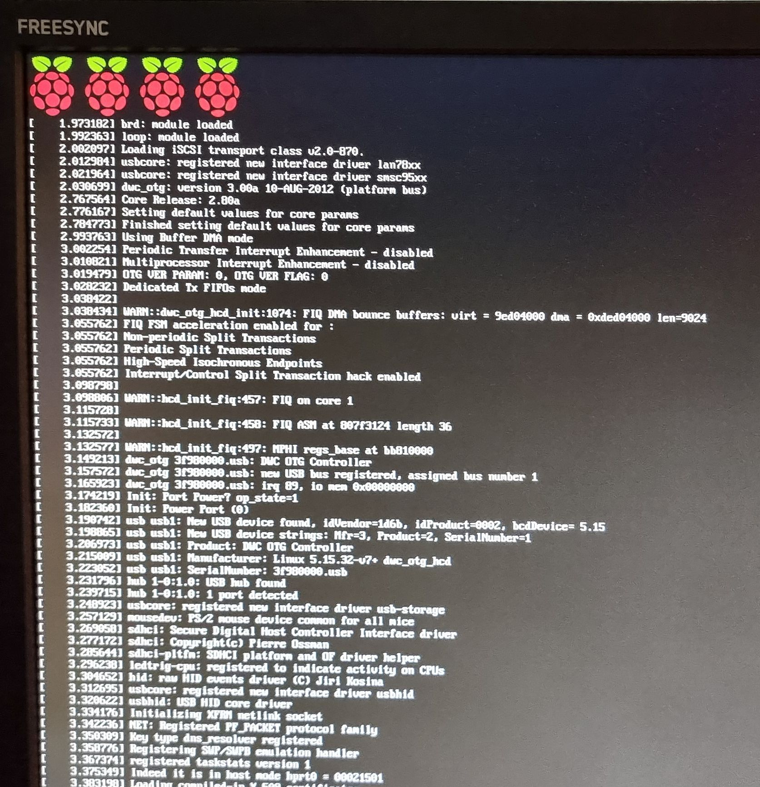

**When you're asked to enter a username, choose "basegnss". I've seen a bug or two where if you pick a different name, it doesn't change it everywhere it needs to - so save yourself some grief here.**

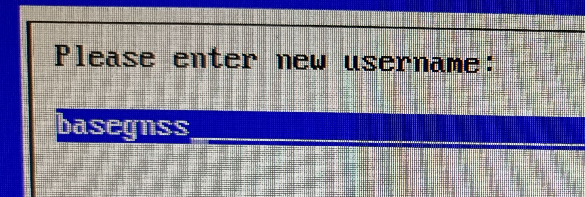

Pick a password, and confirm it.

You might notice that it seems to stick at this stage for a while - be patient, it's normal.
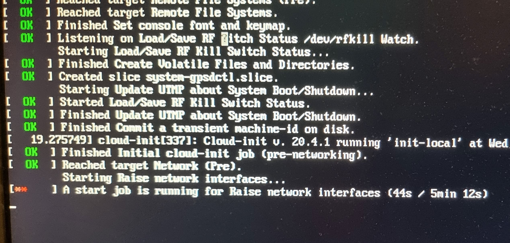
You might also wonder why there's no proper IP address assigned at this stage. Normal if using wifi, eth0 might pick one up at this stage tho, but don't worry at this time if there isn't.

Here, because the ZED-F9P is plugged in, we can see it has detected it (on /dev/ttyACM0) and is configuring it to be a base station. See that red "FAILED" message? We can ignore that just now, it's trying to start the GPS in the background while it's still configuring it. Nothing to worry about.
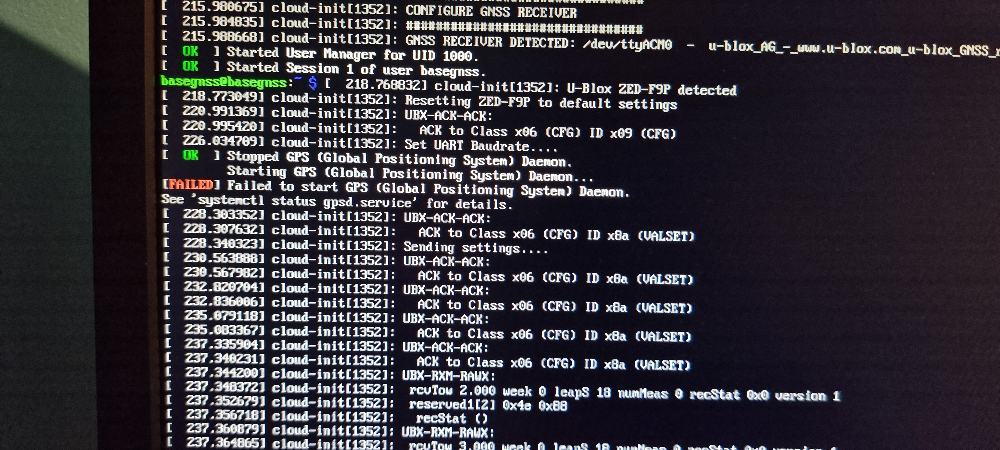
And finally, the all-important "END OF INSTALLATION". You can now go to your web browser on your phone or PC to continue the configuration. You don't need the USB keyboard or the HDMI/TV/monitor attached any more!
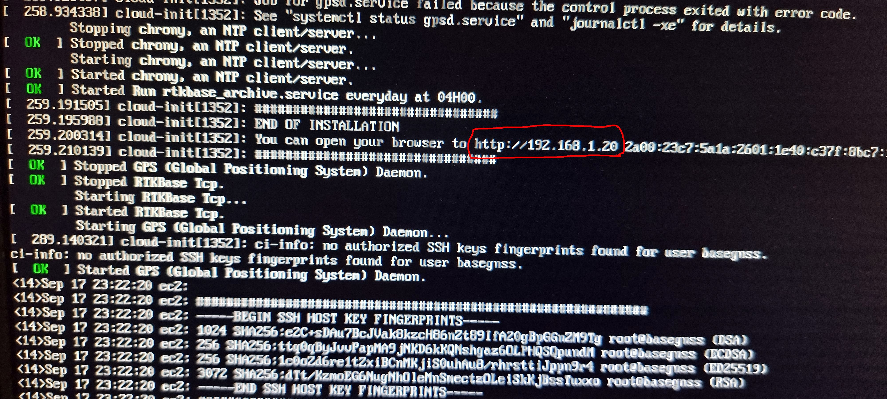

You can now proceed to "[Configuring for your location](ConfigLocation.md)".

---

# What to do if it goes wrong:

- if it doesn't pick up an IP address from wifi, perhaps you got the access name/password wrong in the wpa_supplicant.conf file? Start over on this page again, use Etcher to write a fresh image on the memory card, and take your time
- Still no wifi? Try using a network cable instead
- no output on the TV/monitor? Ensure the memory card is inserted correctly