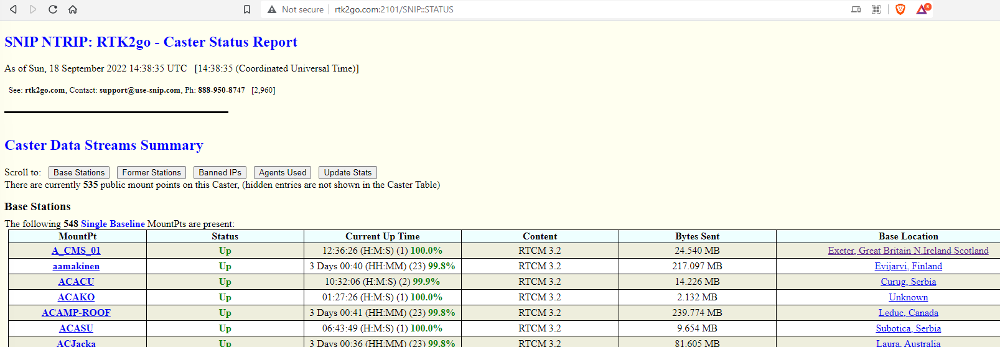

# Publishing to rtk2go

So, at this point, your rtkbase software is up and running, you now have your base set, and everything is good, yes?

Not quite... now you have to push your corrections to rtk2go, so other people can get them.

That's back on the Settings page, and fill it in accordingly with the details as they are in the image below, but obviously changing the Mount Name and Caster Password for the information you set up at registration time. Save, and turn it on.

What's next? Well... nothing. All being well, you're now done and you're now publishing to the rtk2go community, for you and your neighbours benefit !

So let's check that your base is operational. rtk2go.com maintain some operational status pages, and we should look at them once we've turned the Ntrip service on.

The first service to go to is http://monitor.use-snip.com/?hostUrl=rtk2go.com&port=2101 and you should find your mount point in there a minute or two after enabling the service above.

...

You can click the Map link to get an APPROXIMATE location, to nearest hundred meters, of where that base is. Don't be worried that this isn't exact, it's not supposed to be.

You can also get a fuller report with the SNIP status page [here](http://rtk2go.com:2101/SNIP::STATUS).

And that page has all the nice technical stuff on it.

Back on rtk2base, you should now have green lights beside "Main service", "Ntrip service", and "File Service". And that's about it. Seriously. Go get some work done in the field, your work is over here! ;)